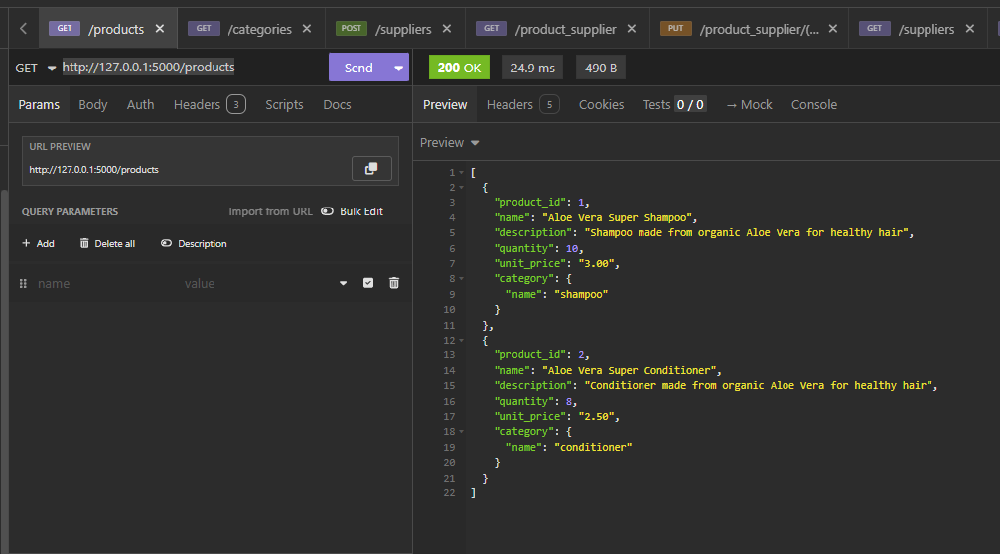
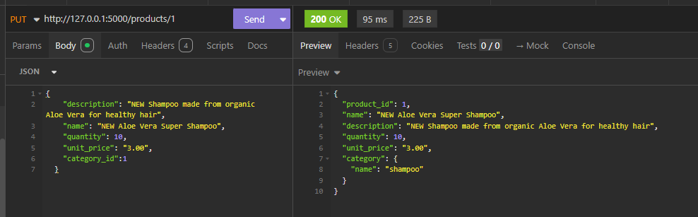
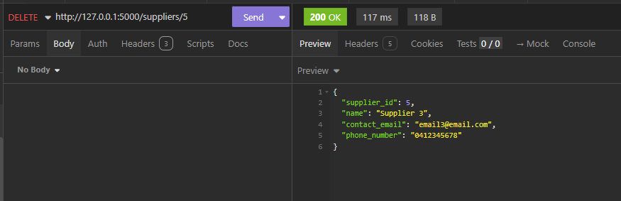
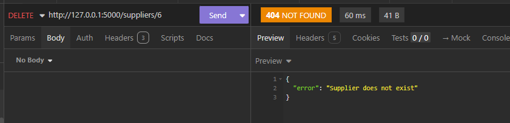
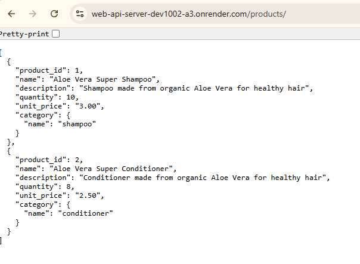

### DEV1002 - Databases & Servers-  Assessment 3 - Design & Programming Web API Server

## Project Overview
This project is a Flask-based Inventory Management Web Server built in Python. It provides structured endpoints for managing products, suppliers, and products categories, with a relational database backend to ensure data integrity and flexible querying.

### Database System: PostgreSQL
PostgreSQL was selected as the database system for this project due to its robustness, flexibility, and alignment with course instruction. Beyond familiarity, PostgreSQL offers:

- **Strong relational integrity** – Ideal for enforcing foreign key constraints and many-to-many relationships.
- **Advanced querying capabilities** – Supports complex joins, subqueries, and indexing strategies.
- **JSON support** – Allows hybrid relational-document storage if needed for future extensions.
- **Open-source and production-ready** – Widely adopted in enterprise environments.

### PostgreSQL Comparison with Other Database Systems

| Database      | Type        | Pros                                         | Cons                                       |
|---------------|-------------|----------------------------------------------|--------------------------------------------|
| **PostgreSQL**| Relational  | ACID-compliant, powerful SQL, strong FK support | Slightly heavier setup than SQLite         |
| **MySQL**     | Relational  | Fast reads, easy replication                 | Weaker standards compliance, limited JSON  |
| **MongoDB**   | NoSQL       | Flexible schema, fast for unstructured data  | No joins, poor fit for relational models   |
| **SQLite**    | Relational  | Lightweight, zero config                     | Not ideal for concurrent or large-scale use|

PostgreSQL strikes the right balance between structure and scalability, making it well-suited for this inventory management system.

# Inventory Management Web Server

The Inventory Management Web System was designed to streamline the organization and tracking of products, their categories, and supplier relationships. 

## Planning Stage 
### Entity Relationship Diagram (ERD)
It its core, the Inventory Management Web System models three primary entities — Category, Product, and Supplier — each with distinct attributes and roles. Products are grouped under categories for logical classification, each product can be sourced from multiple suppliers, and one supplier can source more than one product.

To manage these many-to-many relationships, the Product_Supplier junction table records key transactional details such as supply price and last supplied date. This structure ensures efficient data normalization, supports scalable inventory operations, and enables precise control over stock sourcing and categorization. 

The ERD for the Inventory Management Web System and its relationships can be seen in the following image.

**Relationships:**
- Each Product should belongs to at least one Category.
- One Category can have zero or many Products categorized.
- One Product can be supplied by multiple Suppliers.
- One Supplier can offer many Products.
- The `Product_Supplier` table tracks supply price and last supplied date for each product-supplier pair.

### Database Requirements
- Schema directly implements the **Entity Relationship Diagram (ERD)**
- Normalised to **Third Normal Form (3NF)** to eliminate redundancy and enforce dependencies
- Junction table `Product_Supplier` isolates many-to-many relationships
- Constraints ensure relational integrity and scalability

## Developing Stage
The Inventory Management Web System was developed to satisfy deployment, functionality, and data integrity requirements. 

The implementation employed Python with the Flask framework and a Postgres database. Development and local testing were conducted in VSCode, with endpoint validation performed using both VSCode and Insomnia. The system is deployed via a publicly accessible endpoint on Render and can also be executed locally through Flask, ensuring consistency between development and production environments.

### Data Validation & Security
- Input data validated and sanitised through **Marshmallow schemas**
- Prevents malformed or duplicate entries
- Unique constraints applied to fields such as `category.name` and `supplier.contact_email`

### RESTful API Design  
The Inventory Management Web System was structured according to RESTful principles to ensure clarity, scalability, and maintainability. Four primary controllers were implemented:  

- **GET** → Retrieve data from the database  
- **POST** → Create new records  
- **PUT** → Update existing records  
- **DELETE** → Remove records  

Each controller was designed with robust error‑handling mechanisms to prevent system failures and to maintain data integrity. In particular, safeguards were implemented to avoid duplicate entries and to ensure that invalid requests are properly managed.  

---

### Deployment & Functionality  
The system is publicly accessible through **Render** at the following endpoint:  
[https://web-api-server-dev1002-a3.onrender.com/products](https://web-api-server-dev1002-a3.onrender.com/products)  

It also functions consistently in local environments via `http://127.0.0.1:5000/`. Persistent data storage is managed using **PostgreSQL**, ensuring reliability across both development and production contexts. This dual setup provides consistency between environments and facilitates comprehensive testing.  

---

### API Endpoint Validation  
Validation of the controllers was conducted using **Insomnia** and the integrated testing capabilities of **VSCode**. Screenshots from Insomnia and Render demonstrate successful executions of the GET, POST, PUT, and DELETE requests, confirming proper endpoint functionality. These tests highlight the system’s ability to handle requests accurately, enforce uniqueness constraints, and return appropriate error messages when necessary.  
 

### API Endpoint Validation  
Validation of the controllers was conducted using **Insomnia** and the integrated testing capabilities of **VSCode**. 

Screenshots from Insomnia and Render demonstrate successful executions of the GET, POST, PUT, and DELETE requests, confirming proper endpoint functionality. These tests highlight the system’s ability to handle requests accurately, enforce uniqueness constraints, and return appropriate error messages when necessary.   

**Figures:**  

  
*Figure 1: Successful GET Products request executed locally in Insomnia (`http://127.0.0.1:5000/products`) with nested Categories schema*  

  
*Figure 2: Successful POST Supplier request executed in Insomnia (http://127.0.0.1:5000/suppliers)*  

  
*Figure 3: Successful PUT request executed in Insomnia, Product updated using its id(http://127.0.0.1:5000/products/1)*  

  
*Figure 4: Successful DELETE Supplier by supplier_id request executed in Insomnia(http://127.0.0.1:5000/suppliers/5)* 

  
*Figure 5: Unsuccessful DELETE command, 404 Error because id requested was not found in Insomnia (http://127.0.0.1:5000/suppliers/6)* 

  
*Figure 6: Render deployment showing successful GET products request at public endpoint (https://web-api-server-dev1002-a3.onrender.com/products)*  

These tests highlight the system’s ability to handle requests accurately, enforce uniqueness constraints, and return appropriate error messages when necessary.   

## Peer's Feedback and Response
As part of the planning stage, I sought feedback from two peers to refine the ERD and database design. Their insights helped improve the accuracy and robustness of the schema.

Both sets of feedback were highly valuable in strengthening the ERD and database design:

- **Feedback 1** ensured the **accuracy of relationships** in the junction table, preventing misinterpretation of the many-to-many structure.  
- **Feedback 2** improved **data integrity and clarity**, ensuring that products are always tied to a category and that duplicate records are avoided.  

By implementing these changes, the ERD now better reflects real-world inventory management requirements and enforces stricter relational rules, making the system more reliable and scalable.
